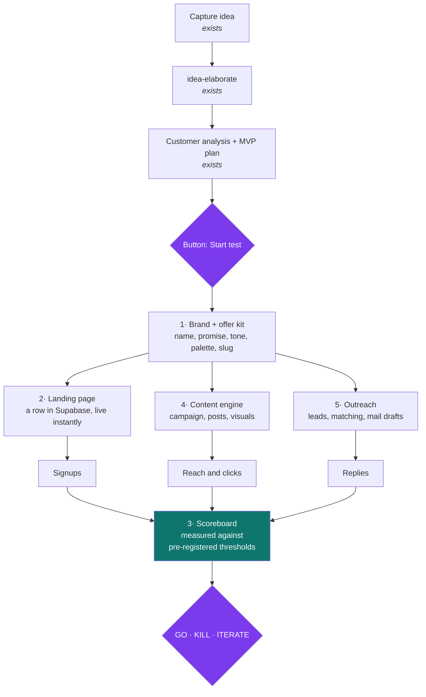

# Idea → MVP: the validation factory

How a business idea in Strategie HQ grows automatically into a complete test package
(landing page, social content, email, outreach) *and* into a hard **GO / KILL / ITERATE** verdict.

This is the design, not the implementation yet. It builds on what already exists — which is more
than it looks — and makes a deliberate call per step between edge function, Apps Script,
Claude Routine, and "just do it yourself".

---

## 1. What already exists

The first half of the chain is done and running:

| Piece | Where | Status |
|---|---|---|
| Capture an idea (voice or text) | `IdeaCaptureCard.tsx`, `heyra/agents/ideaAgent.ts` | ✅ works |
| Strategic elaboration (score, SWOT, financials, markdown) | `idea-elaborate` edge function, automatic | ✅ works |
| Customer analysis, personas, competitors, pricing | `idea-customer-analysis`, opt-in button | ✅ works |
| MVP validation plan (experiments, channels, roadmap, success signals) | `idea-mvp-plan`, opt-in button | ✅ works |
| Overview UI for all of the above | `src/views/StrategieHQ.tsx` | ✅ works |
| Mirror to the Obsidian vault | `materialize-note` | ✅ works |
| Convert an idea into a real project | `linked_project_id` | ✅ works |

And — importantly — **the second half is already schema'd but was never built.**
Migration `20260805130000_outreach.sql` already ships:

- `campaign_plan` / `content_creation` / `email_sequence` columns on `business_ideas`
  (with the same status/error/data triplet as `mvp_plan`)
- `outreach_identity` (per-idea sender persona)
- tables `leads`, `outreach_targets`, `outreach_emails`
- RLS and realtime already wired

The TypeScript types are already in `src/types.ts` and `src/store.ts`, including fetchers and
realtime subscriptions. What's missing: **the edge functions that fill those columns, and the UI
that shows them.** So there's no new foundation to lay — there's a foundation to fill in.

## 2. What's missing

Four gaps, in order of importance:

1. **No landing-page engine.** Without somewhere for someone to leave an email, there's no signal.
2. **No scoreboard.** Nothing tracks visitors/signups/replies per idea, and nothing compares them
   against the `successSignal` thresholds `idea-mvp-plan` already writes. Without this, "is this
   idea worth pursuing" stays a gut feeling.
3. **No content production.** The columns exist, the generation doesn't.
4. **No brand/offer layer.** Every idea needs a name, a one-line promise, a tone and a palette
   before the landing page and content can be consistent.

## 3. The chain

Six sections, each independently useful and independently buildable.

---

## 4. The six sections

### Section 1 — Brand and offer kit  ·  `idea-brand-kit`

Small, but it blocks everything else. One Claude call that distills from the existing documents
(overview, personas, positioning, pricing):

- **name + slug** (must be unique — it becomes the URL)
- **one-line promise** (the landing page headline)
- **three core benefits**, grounded in the personas
- **objection handling** (comes straight out of `customerAnalysis.personas[].objections`)
- **offer + price** (from `pricingSuggestion`)
- **tone** and **palette** (2 colors + a font choice from a fixed shortlist)
- **primary call to action**: waitlist / book an intake / pre-pay
- **best-fitting social channel**, argued from the audience

New `brand_kit jsonb` column plus status/error on `business_ideas`. Same shape as `mvp_plan`.

### Section 2 — Landing page engine  ·  *the decision that matters most*

**Don't:** generate a site per idea, commit it to a repo and deploy it to Vercel. That's a build,
a deploy, a domain, DNS wait time and a repo filling up with dead ideas — per idea.

**Do:** one Vercel app that reads a row from Supabase at `/<slug>` and renders it.
Putting a new idea live = **one INSERT**. No build, no deploy, seconds instead of hours.

- New table `idea_landing` (slug, kit fields, published flag, A/B variant)
- New table `idea_signups` (slug, email, answer to one qualifying question, referrer, UTM)
- Publicly readable through a **view that only exposes published rows** — never open up
  `business_ideas` itself, that holds the entire strategy
- Signup writes go through an edge function (`landing-signup`) with rate limiting, not direct
- 3–4 fixed templates (waitlist / service / product / booking) that apply the brand kit's palette —
  no AI inventing HTML per idea, that's slow and unreliable

**Domains:** start with subpaths on one fixed domain (`test.yourdomain.nl/<slug>`). Only buy a real
domain once an idea survives its first test. Saves €10 and a day of DNS per dead idea.

SEO is irrelevant here — traffic comes from your posts and emails, not from Google.

### Section 3 — Scoreboard and verdict  ·  *the answer to the actual question*

This is the part that's in none of the "AI builds your business" stories and is exactly what you
need.

- New table `idea_metrics` — daily rollup per idea: visitors, signups, conversion, emails sent,
  replies, positive replies
- **Freeze the thresholds up front**, from `mvpPlan.experiments[].successSignal` — they're already
  generated, they're just never used. When a test starts they get frozen into `idea_test_run`
  (start date, duration, threshold per metric). Moving the bar afterwards is precisely how you
  fool yourself.
- When the run ends: a verdict card in Strategie HQ with the numbers next to the thresholds and an
  explicit **GO / KILL / ITERATE**, plus a Telegram message.

Build this early. Without it you're only producing assets.

### Section 4 — Content engine

Fills the already-existing `campaign_plan` and `content_creation` columns.

- `idea-campaign-plan` — goal, key message, channel choice with an angle per channel, cadence, KPIs
- `idea-content-pieces` — 15–25 concrete pieces: hook, copy, hashtags, CTA, image brief, suggested
  publish date
- **Visuals via the Canva connector** — image brief → an actual design, exported to Drive
- **Content calendar as a Google Sheet**, written by Apps Script. Deliberately Google and not the
  app: you want to scroll, rewrite and tick things off on your phone, and a Sheet is better at that
  than anything I'd build inside OSLIFE.

**This is where the human stays in the loop.** Auto-posting to Instagram/TikTok requires a
business/creator connection, Meta app review and token management per account. Connecting a new
account per idea makes that worse than the work it saves. So: everything gets produced and
scheduled up to "ready to post", and you press post. If an idea shows promise, *then* wire up a
scheduler (Buffer/Metricool) — their APIs are a fraction of the work of Meta's.

### Section 5 — Outreach

All tables already exist. To build:

- `idea-email-sequence` — fills `email_sequence` (3–4 steps with intervals)
- `idea-match-leads` — reads the leads Sheet via Apps Script → `leads`, scores them per idea
  against the personas → `outreach_targets` with `fit_score` and reasoning
- `idea-draft-outreach` — personalizes per target, creates real Gmail drafts through the existing
  `create-gmail-draft`, and records them in `outreach_emails`

Drafts, not automatic sending. You review them in a batch and send yourself — that's the difference
between outreach and spam, and it costs you five minutes per twenty emails. Reply detection needs
no new work: match `gmail_thread_id` against the `gmail_messages` Apps Script already syncs.

### Section 6 — Orchestrator

One `idea-launch-tick` edge function on `pg_cron` that walks a state machine per running test:
which step is done, which can start, where it's waiting on you. A Telegram message at every human
gate. Exactly the pattern `fiverr-process-intake` already runs.

Build this **last**. Until then these are buttons in Strategie HQ, and that's fine — you can fully
test ideas before the glue exists.

---

## 5. Which tool for what

| Tool | For | Why |
|---|---|---|
| **Supabase edge functions + `pg_cron`** | the entire core chain | Runs server-side whether or not a laptop is on. Exactly the pattern the Fiverr pipeline already proves. |
| **Google Apps Script** | leads Sheet, content calendar, Docs | Only where Google is the system of record. Not a scheduler — Apps Script triggers are more brittle than `pg_cron`. |
| **Claude Code Routine** | weekly digest of running tests; work that needs a repo/build | Powerful, but depends on a session. Not suitable as the backbone. |
| **Canva connector** | visuals for the content | Already connected, produces real designs instead of descriptions. |
| **Telegram bot** | approval gates and notifications | Already built and in use. |
| **You** | posting, sending mail, design taste | The three things where automating costs more than it returns. |

**Deviation from an existing note:** the comments in `20260805130000_outreach.sql` say the outreach
columns would be filled by a *Routine*. The recommendation is to flip that to edge functions on
`pg_cron`, for the same reason stated in `README-fiverr-intake.md`: it must not depend on whether a
session happens to be running somewhere. The columns themselves stay unchanged.

## 6. Build order

Ordered by "when does this become useful to me", not by technical logic.

| # | Section | Delivers | Rough size |
|---|---|---|---|
| 1 | Brand and offer kit | every idea has a name, promise, slug, palette | small |
| 2 | Landing page engine + signups | **from here on you can already test ideas** | large |
| 3 | Scoreboard + verdict | testing now answers the real question | medium |
| 4 | Content engine + calendar + Canva | traffic to those pages | large |
| 5 | Outreach | second traffic source, tables already exist | medium |
| 6 | Orchestrator + Telegram gates | one button instead of six | small |

After step 3 you have a working validation factory — just with manual traffic.
Steps 4 and 5 scale it up. Step 6 is comfort.

## 7. What still needs deciding

1. **Domain for the test pages.** Proposal: one existing domain, a subpath per idea, only buy a
   dedicated domain for a survivor.
2. **Default call to action.** A waitlist is easiest but the weakest signal; a deposit or a booked
   appointment is a far harder yes. Proposal: choose per idea in the brand kit, with "book a call"
   as the default for service ideas.
3. **Default test duration.** Proposal: 14 days, then a verdict is forced.
4. **Social channel fixed or free per idea?** Proposal: the brand kit picks one based on the
   audience, and the content engine only produces for that one. Filling one channel properly beats
   filling three halfway.
